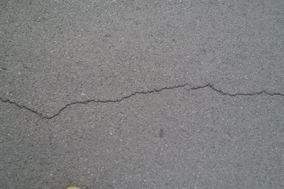
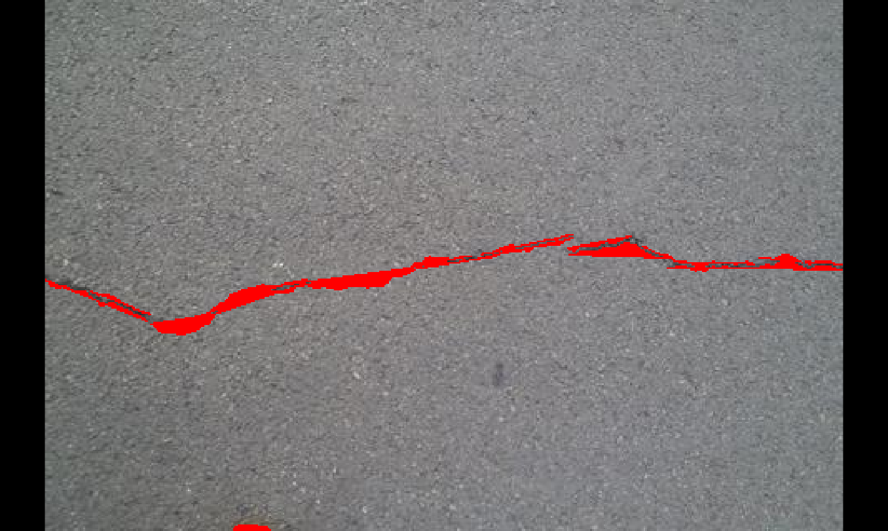
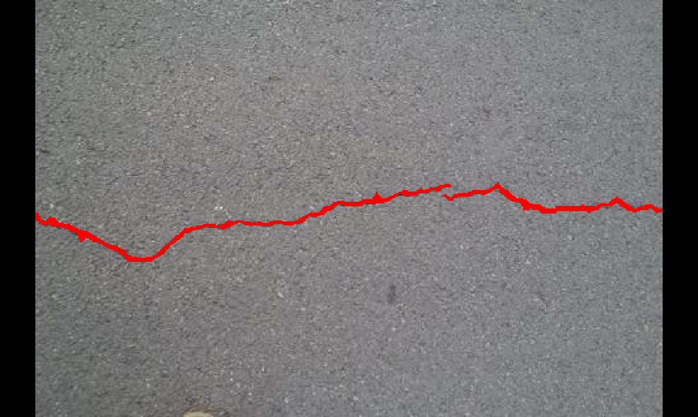

Cracks Detection on Building Walls Based on Halcon

#Project Description

| 原图 | 检测结果 | Ground Truth |

|------|----------|--------------|

|  |  |  |

This is a project for learning to use Halcon software, which applies traditional image processing methods to an open-source dataset for crack detection. The current performance of the project is average and still needs further optimization.

#Main Methods

Crack edges are detected using the Canny operator. Detection regions are selected through thresholding. Finally, the results are evaluated using two metrics: IoU and F1-score.

#基于Halcon的建筑墙面裂痕检测

#项目说明

这是一个学习使用halcon软件的项目，使用了传统图像处理方法对开源数据集进行裂痕检测。该项目目前表现效果一般，还有待进一步的优化。

#主要的方法为

通过canny算子检测出裂痕边缘，通过阈值化处理选取检测区域，最后通过IoU 和F1-score两种标准对检测结果进行评估。
