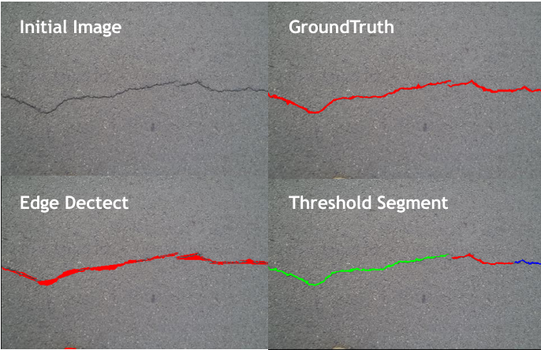
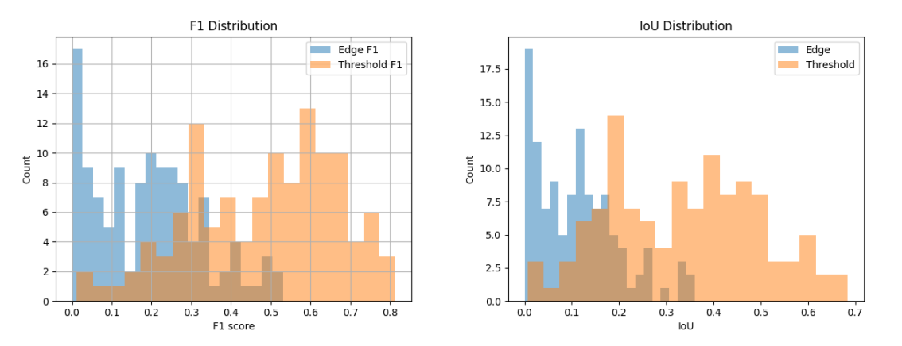

#Building Wall Crack Detection Based on Halcon

#Project Description
This is a learning project for using the Halcon software, employing traditional image processing methods to detect cracks in an open-source dataset. The current performance of the project is moderate and still requires further optimization.

#Update Notes
Added the threshold_seg_loop.hdev script.
Morphological bottom-hat processing and threshold segmentation methods were used for crack identification. The automatic threshold segmentation method adopts Otsu's method. Direct automatic threshold segmentation does not perform well because the crack regions contain too few pixels. Pre-clipping the grayscale range can improve the segmentation performance.
Compared with the edge detection method, the threshold segmentation method has significantly improved both the F1 score and IoU evaluation metrics (with an average increase of more than double). More importantly, the edge detection method may lose the target in some images, whereas the threshold segmentation method detected all cracks in the dataset.

#Main Methods
1.Edge detection method: Detect crack edges using the Canny operator, select detection regions through thresholding, and finally evaluate the detection results using both IoU and F1-score metrics.

2.Threshold segmentation method: First suppress noise using mean filtering or Gaussian filtering, then suppress the influence of uneven backgrounds through bottom-hat processing, and finally obtain cracks via threshold segmentation and region selection.

#基于Halcon的建筑墙面裂痕检测

#项目说明
这是一个学习使用halcon软件的项目，使用了传统图像处理方法对开源数据集进行裂痕检测。该项目目前表现效果一般，还有待进一步的优化。

#更新说明
新增了threshold_seg_loop.hdev脚本。
使用了形态学底帽处理和阈值分割的方法进行裂痕识别。自动阈值分割方法采用大津法（Otsu），直接使用自动阈值分割效果不好，因为裂痕部分的像素太少。预先剪裁灰度区间能使分割效果获得提升。
与边缘检测的方法相比较，阈值分割的方法在F1 score和IoU评价指标都有明显提升（平均增幅超过一倍）。同时更重要的是，边缘检测方法在某些图片上会失去目标，而阈值分割方法检测到了数据集中的所有裂痕。

#主要的方法为
1.边缘检测方法：通过canny算子检测出裂痕边缘，通过阈值化处理选取检测区域，最后通过IoU 和F1-score两种标准对检测结果进行评估。
2.阈值分割方法：首先通过均值滤波或者高斯滤波抑制噪声，然后通过底帽处理抑制不均匀背景的影响，最后使用阈值分割与区域筛选获得裂痕。
